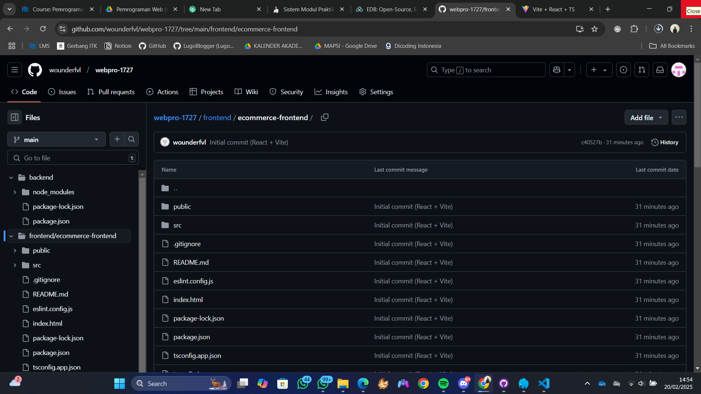

# Assignment 01 - Web Programming

Ansellma Tita Pakartiwuri Putri (10231017 - BackEnd)
Dahayu Azhka Daeshawnda (10231027 - FrontEnd)

After following the module's instruction of today's class, we have successfully followed the instruction as below:

1. Making GitHub repositories
   
   https://github.com/wounderfvl/webpro-1727

2. Installed the FrontEnd project (React + Vite)
   

3. Installed PostgreSQL, NPM, and Node.js
   

4. Made the database for "e-commerce kecil" and user "postgres"
   
