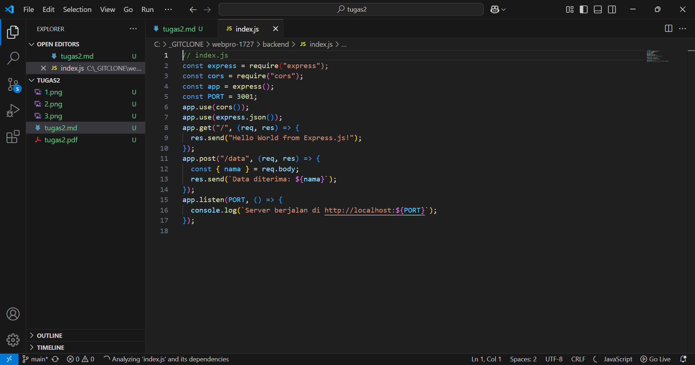
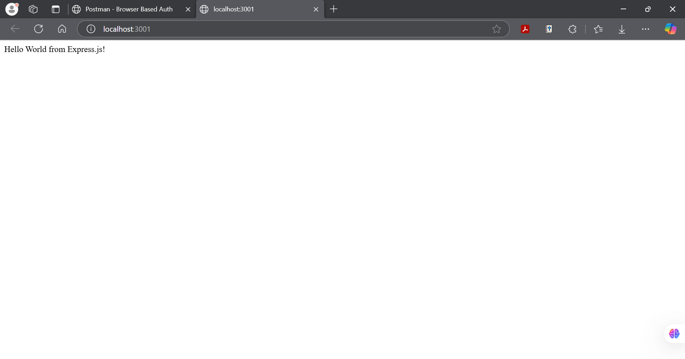
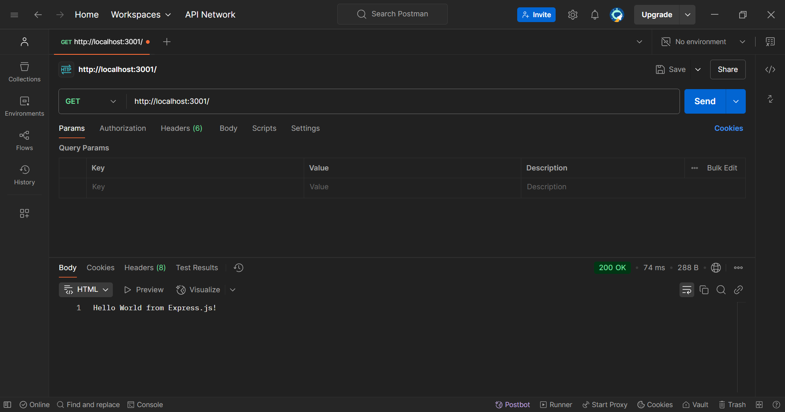
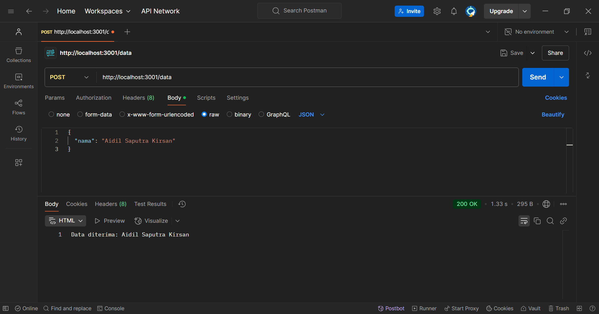

# Assignment 01 - Web Programming

Ansellma Tita Pakartiwuri Putri (10231017 - BackEnd)
Dahayu Azhka Daeshawnda (10231027 - FrontEnd)
https://github.com/wounderfvl/webpro-1727

After following the module's instruction of today's class, we have successfully followed the instruction as below:

1. Made index.js and ran the server without any troubles
   
   

2. Added route GET using Postman
   

3. Added route POST using Postman
   