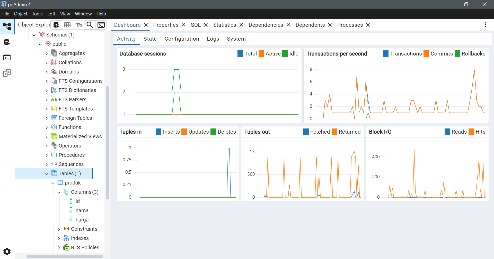

# Assignment 01 - Web Programming

Ansellma Tita Pakartiwuri Putri (10231017 - BackEnd)
Dahayu Azhka Daeshawnda (10231027 - FrontEnd)
https://github.com/wounderfvl/webpro-1727

After following the module's instruction of today's class, we have successfully followed the instruction as below:

1. Installed `npm install pg` and connected Express.js with Postgre
   

2. Added data on the table using query CREATE on Postman
   

3. Read the data stored on the table using query READ on Postman
   

4. Made the product table on `ecommerce-kecil` database in Pgadmin
   
   