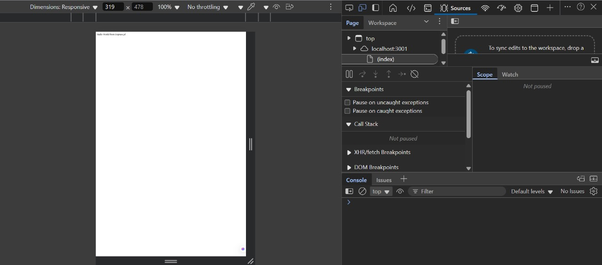
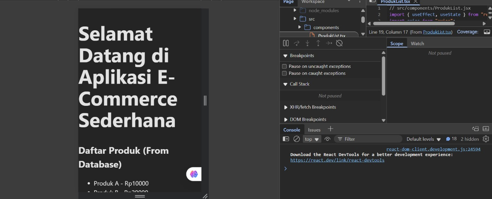

# Assignment 05 - Web Programming

Ansellma Tita Pakartiwuri Putri (10231017 - BackEnd)
Dahayu Azhka Daeshawnda (10231027 - FrontEnd)
https://github.com/wounderfvl/webpro-1727

After following the module's instruction of today's class, we have successfully followed the instruction as below:

1. The React frontend built with Vite successfully fetches and displays data from our Express backend API endpoint without any errors.
   

2. We've properly configured CORS (Cross-Origin Resource Sharing) on our Express server, allowing the frontend to securely communicate with the backend even though they're running on different origins.
   

3. Application runs cleanly without any console errors, indicating proper implementation of both frontend and backend code.
   

   This setup represents a fundamental pattern in modern web development where a decoupled frontend (React) communicates with a backend API (Express) through HTTP requests, allowing for a more modular and maintainable architecture. The successful CORS implementation specifically addresses the security restrictions browsers impose on cross-origin requests, which is crucial for this architecture to work properly in development and production environments.
