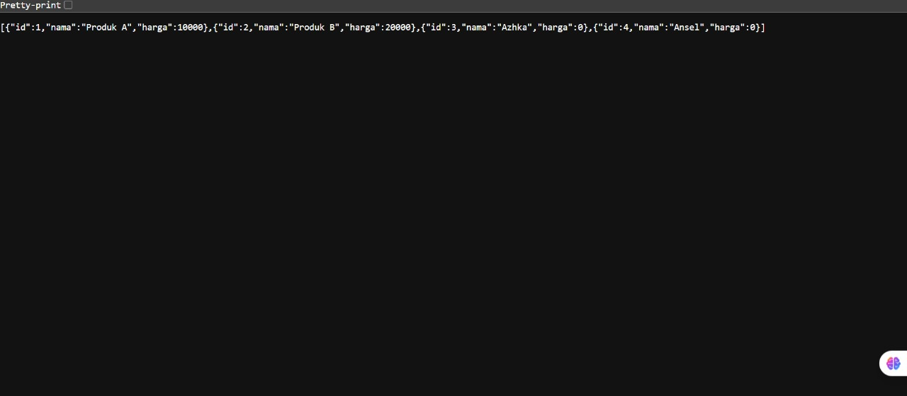

# Assignment 04 - Web Programming

Ansellma Tita Pakartiwuri Putri (10231017 - BackEnd)
Dahayu Azhka Daeshawnda (10231027 - FrontEnd)
https://github.com/wounderfvl/webpro-1727

After following the module's instruction of today's class, we have successfully followed the instruction as below:

1. Component Implementation
   The backend developer successfully created and integrated the "TambahProduk.tsx" component into their React application. This component provides a user interface for adding new products to the system. The implementation follows React's component-based architecture, allowing for modular code organization and reusability while maintaining a clean separation of concerns within the application structure.

Successfully adds new product

2. Form Validation Implementation
   The developer implemented simple yet effective form validation within the product addition workflow. This validation ensures data integrity by preventing submissions with empty fields, which could otherwise lead to incomplete or corrupted database entries. The system properly displays error messages to guide users when input requirements are not met, enhancing the overall user experience and application reliability.

Error when adding product without name

Error when adding product without price

Error when adding product without name and price

3. Database Integration
   The developer established successful database connectivity, enabling the application to persistently store newly added product data. The submitted form data was correctly processed, transmitted to the backend, and stored in the database. This confirms the end-to-end functionality of the application's data flow, from user input through the React frontend to storage in the backend database system.

