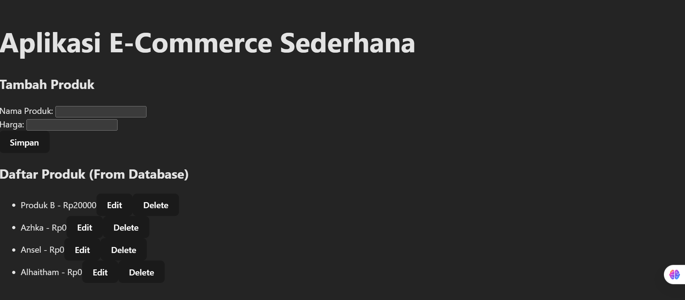

# Assignment 07 - Web Programming

Ansellma Tita Pakartiwuri Putri (10231017 - BackEnd)
Dahayu Azhka Daeshawnda (10231027 - FrontEnd)
https://github.com/wounderfvl/webpro-1727

After following the module's instruction of today's class, we have successfully followed the instruction as below:

1. PUT and DELETE endpoints
   The Backend developer successfully implemented PUT and DELETE endpoints in the backend service. These endpoints properly handle data modification and removal requests, completing the full set of CRUD operations on the server side according to RESTful API principles.

2. Frontend Integration
   The frontend application now features functional edit and delete capabilities with proper UI elements. These controls correctly trigger the appropriate HTTP requests to the backend endpoints, demonstrating successful event handling and API integration that allows users to modify and remove products through the interface.

3. Error-Free Operatio
   The application demonstrates complete CRUD functionality without errors or exceptions. This indicates proper validation, error handling, and communication between frontend and backend components throughout all data management operations.

4. Data Synchronization
   The product listing view accurately reflects all database changes after create, update, and delete operations. This confirms that the application maintains proper state synchronization with the database and implements effective UI updates after data modifications, providing users with accurate visual feedback.

Read

Edit

Delete

Create

