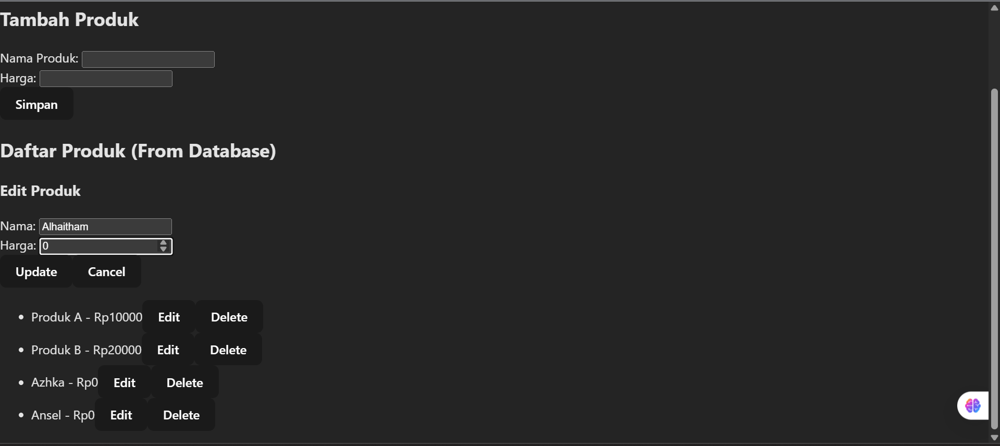
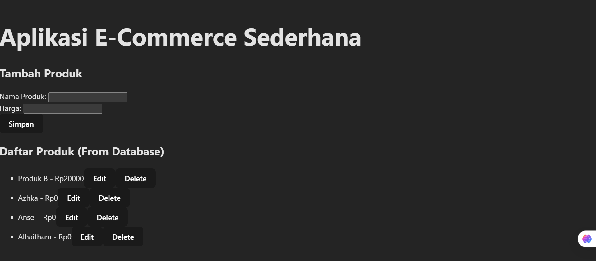
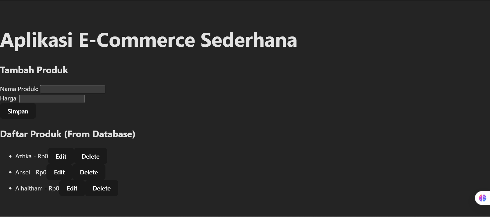
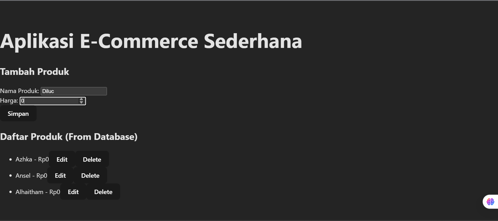
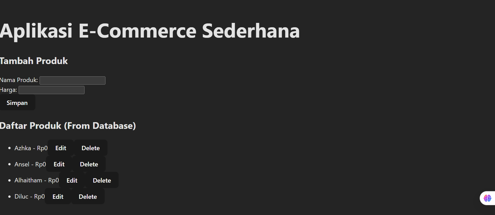
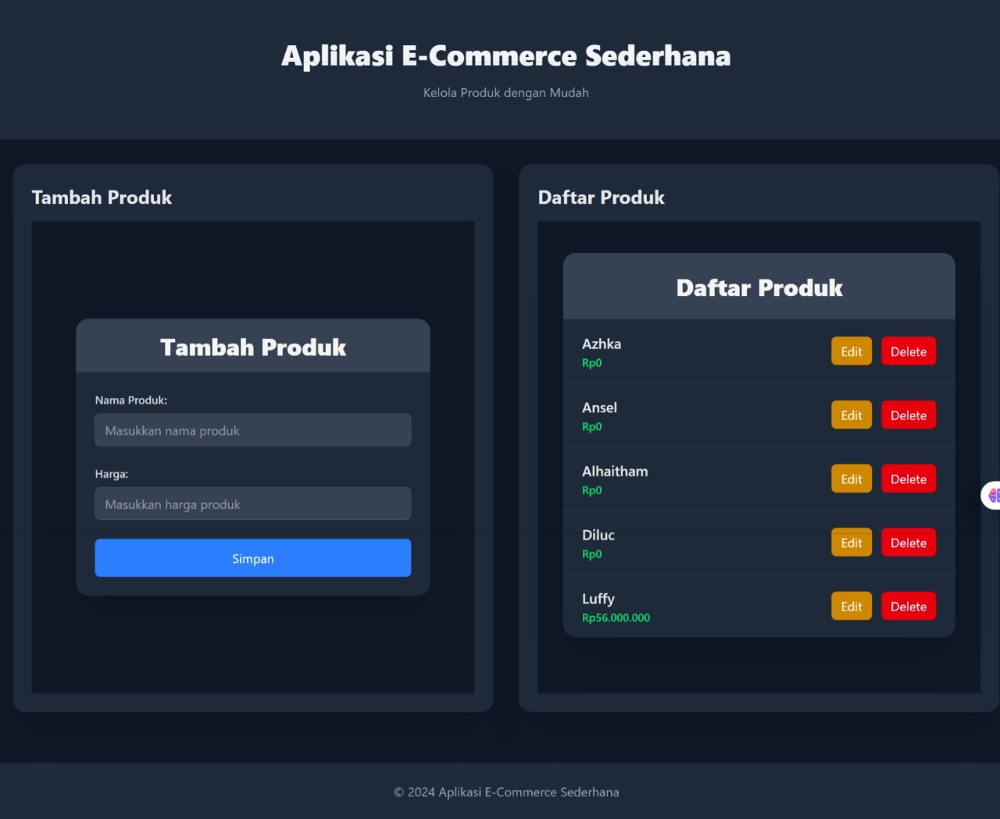
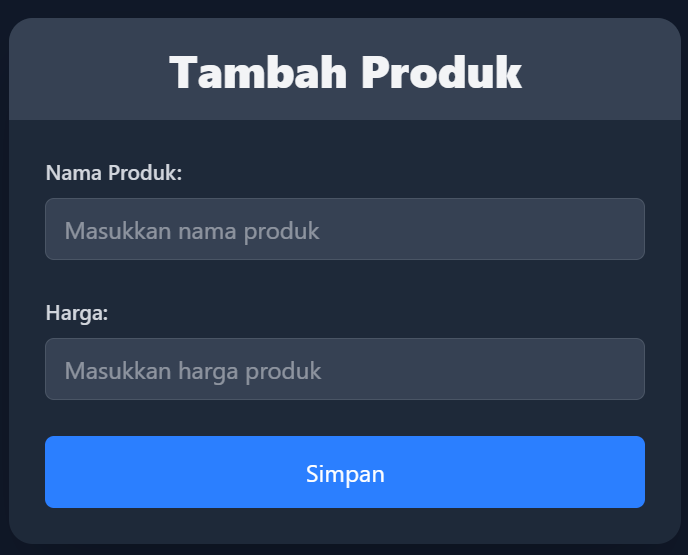
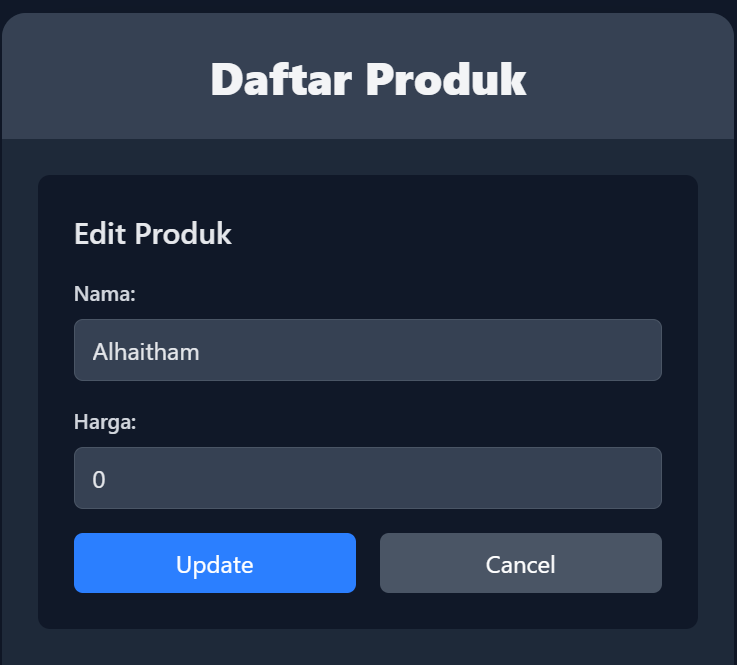
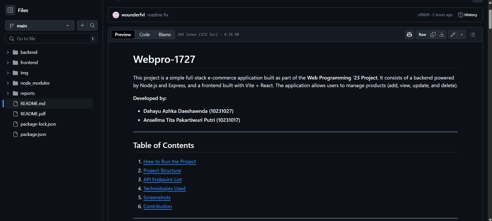

# Midterm Exam - Web Programming

Ansellma Tita Pakartiwuri Putri (10231017 - BackEnd)
Dahayu Azhka Daeshawnda (10231027 - FrontEnd)
https://github.com/wounderfvl/webpro-1727

Our web application successfully implements full CRUD (Create, Read, Update, Delete) functionality, ensuring smooth interaction between the frontend and backend.

1. Backend CRUD Implementation

The backend service is fully equipped with the necessary endpoints for handling product data, including PUT (update) and DELETE (remove) operations. These endpoints function correctly, adhering to RESTful API principles, and allow seamless data modification while maintaining database integrity.

2. Frontend Integration & User Interaction

The frontend effectively integrates these backend capabilities, providing users with interactive controls for editing and deleting products. The interface correctly triggers HTTP requests, ensuring that modifications made through the UI are reflected in the database. This demonstrates the successful implementation of event handling and API communication.

3. Error Handling & Stability

The application runs without errors or unexpected behavior, confirming that proper validation and error handling mechanisms are in place. Whether users create, update, or delete products, the system processes requests reliably, preventing data inconsistencies and ensuring smooth operation.

4. Real-Time Data Synchronization

Any changes made to product data are instantly reflected in the UI, ensuring accurate state management. When a user adds, updates, or deletes a product, the product listing dynamically updates to match the database, providing a consistent and responsive experience.

Read

Edit

Delete

Create

We have also successfully implemented the user interface for our web application using a combination of CSS and Tailwind CSS, ensuring a visually appealing and responsive design that enhances the overall user experience as below.

Additionally, we have created and included a README file to provide clear documentation and guidance for users and developers that can be accessed by the link below :
https://github.com/wounderfvl/webpro-1727/blob/main/README.md

